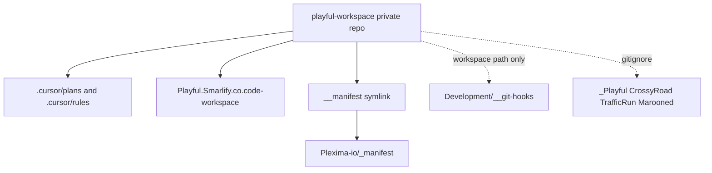

# Private Playful workspace repo

Same shape as [Plexima’s workspace repo](/Users/dave/Development/_Plexima): this repo is the folder around the games, not the games. Each app keeps its GitHub remote and Heroku remote. No submodules.

The workspace file is already here: [Playful.Smarlify.co.code-workspace](/Users/dave/Development/_Smarlify/Playful.Smarlify.co/Playful.Smarlify.co.code-workspace). It does not need to move. Only its folder links change.

## Layout

- Move `/Users/dave/Development/_GameDev/Marooned` to `/Users/dave/Development/_Smarlify/Playful.Smarlify.co/Marooned`. Its `.git`, remotes, and `.env` move with it. Remove `_GameDev` only if it is empty afterward.
- Symlink `__manifest` to `../../_Plexima/__manifest` and commit the symlink. That is the existing checkout of `Plexima-io/_manifest`, not a second clone and not a copy.
- Leave `__git-hooks` at `/Users/dave/Development/__git-hooks`. [Smarlify.co.code-workspace](/Users/dave/Development/_Smarlify/Playful.Smarlify.co/Smarlify.co.code-workspace) and [Svobodni.code-workspace](/Users/dave/Development/_Svobodni/Svobodni.code-workspace) already point there.

## Workspace file

Update [Playful.Smarlify.co.code-workspace](/Users/dave/Development/_Smarlify/Playful.Smarlify.co/Playful.Smarlify.co.code-workspace):

- Replace `{ "path": "../../_GameDev" }` with `{ "name": "Marooned", "path": "Marooned" }`.
- Add `{ "name": "__manifest", "path": "__manifest" }`.
- Add `{ "name": "workspace", "path": "." }` so `.cursor/plans` and `.cursor/rules` are a workspace root.
- Keep `__git-hooks` at `../../__git-hooks`.
- In workspace settings, exclude the nested app folders from the `workspace` root view (`_Playful`, `CrossyRoad`, `TrafficRun`, `Marooned`, `SpaceShooter`, `Pacman`) so those trees are not listed twice.

## What the repo tracks

New private GitHub repo `davidnekovarcz/playful-workspace` (name is free). Local `git init` in `Playful.Smarlify.co`.

Tracked:

- `Playful.Smarlify.co.code-workspace`
- `__manifest` symlink
- `.gitignore` with `.DS_Store` plus the nested repos: `_Playful/`, `CrossyRoad/`, `TrafficRun/`, `Marooned/`, `SpaceShooter/`, `Pacman/`. Also ignore `Smarlify.co.code-workspace`, `firebase.json`, `firestore.rules`, and `package.json` so the loose files already in this directory are not swept in.
- `.cursor/rules/playful-manifest.mdc`: follow `__manifest/README.md`. Do not copy the ZNDB stack lines from Plexima’s rule.
- `.cursor/rules/git-hooks.mdc`: shared kit stays at `../../../__git-hooks` from a game repo in this folder. Document the path only. Do not change git config.
- `.cursor/plans/`: move the two untracked plans out of `_Playful/.cursor/plans/` (`marooned_early_access_bbd8adb4.plan.md`, `marooned_survival_scores_e262a210.plan.md`). Leave `__git-hooks/.cursor/plans/` where it is.
- A short `README.md` that says this repo stores the workspace layer and refuses the game trees.

The machine-wide ignore at `~/.config/git/ignore` already hides `.DS_Store` everywhere. This repo’s `.gitignore` repeats that line so a clone is covered without that home file.

Do not set `core.hooksPath`. Do not commit `.env` or game source. After the local commit, `gh repo create davidnekovarcz/playful-workspace --private --source=. --remote=origin --push`.
