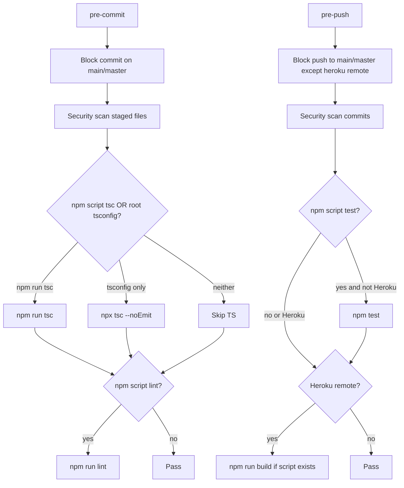

# Universal git-hooks (capability-based)

## Decisions (locked)

- **SoT:** [davidnekovarcz/git-hooks](https://github.com/davidnekovarcz/git-hooks) via local `~/Development/__git-hooks`
- **smarlify/git-hooks:** make **1:1** with SoT after the update
- **Do not port** smarlify-only bits (`post-push` LifegutDietBuddy/CYPRESS.md, hard-coded GA4 ID) — they name specific apps
- **Remove** all TrafficRun / CrossyRoad / SpaceShooter (and any other app) name checks from the hooks repo
- **No nested `./web` detection** in shared hooks; Marooned already exposes root scripts (`lint` / `tsc` / `test`) that prefix into `web/`

## Why smarlify is discarded as SoT

smarlify is behind and diverged with project-specific hooks. david already has the better shared layout (`shared/quality-checks.sh`, `shared/security-check.sh`, Heroku exception, TTY-safe colors). Sync smarlify to david after publishing.

## Gaps to close (current SoT)

In [`shared/quality-checks.sh`](/Users/dave/Development/__git-hooks/shared/quality-checks.sh):

- Hardcoded game skips
- TS only if **root** `tsconfig*.json` then bare `npx tsc --noEmit` (misses Marooned’s `npm run tsc`)
- Tests are Cypress + `localhost:3000` only; pre-push currently comments them out

## Target behavior

### `shared/quality-checks.sh`

- Remove all repo-name skip lists / game mentions
- Add `has_npm_script <name>` helper (`npm run <name> --dry-run`)
- **`run_typescript_check`:** if `tsc` script → `npm run tsc`; else if root `tsconfig.json` / `tsconfig.app.json` / `tsconfig.node.json` → `npx tsc --noEmit`; else skip
- **`run_linting`:** if `lint` script → `npm run lint`; else skip (drop `repo_name` param)
- **`run_tests` (new):** if `test` script → `npm test`; else skip. No Cypress/port hard-coding (Vitest/Jest/generic all work)
- Keep **`run_build_check`** as-is (script-gated)
- Drop unused Rails detect / `repo_name` plumbing if nothing consumes it after the cleanup

### `pre-commit` / `pre-push`

- Wire new helpers; stop passing repo names into quality runners
- **pre-push:** re-enable tests via `run_tests` for non-Heroku pushes (replace commented Cypress block)
- Keep Heroku: skip local tests, run build

### `README.md`

- Document capability-based checks (lint / tsc / test / build when available)
- Remove game-name exclusion note
- Clarify root-oriented layout; nested apps should expose root npm scripts (Marooned pattern)
- Note smarlify fork tracks david 1:1

### Small fix while touching hooks

- [`prepare-commit-msg`](/Users/dave/Development/__git-hooks/prepare-commit-msg): entry currently requires `$1 = "prepare-commit-msg"` but Git passes `(COMMIT_MSG_FILE, [source])`, so the helper never runs — call `prompt_commit_message "$1"` when invoked as a hook

## Marooned local (minimal)

- No nested-path logic in shared hooks
- After SoT update: re-run [`scripts/apply-git-hooks.sh`](/Users/dave/Development/_GameDev/Marooned/scripts/apply-git-hooks.sh) so `.githooks` stays a 1:1 mirror
- Root scripts already correct — hooks will pick up `npm run tsc` / `lint` / `test` without a root `tsconfig.json`

## Publish

1. Commit + push on `~/Development/__git-hooks` → `davidnekovarcz/git-hooks` `main`
2. Sync `smarlify/git-hooks` `main` to the same tree (reset/force-align to SoT; drop divergent project-specific files)
3. Refresh Marooned `.githooks` mirror via apply script

## Out of scope

- Nested `web/` / `client/` path probing in shared hooks
- Restoring smarlify `post-push` / GA4 reminders
- Changing Marooned Heroku build’s `rm -rf web/node_modules`
